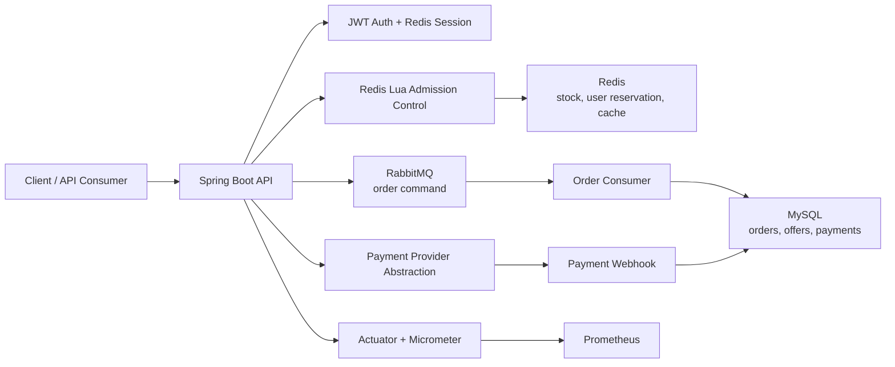

# Flash Sale Platform

Production-oriented flash-sale and payment backend built with Spring Boot, Redis, RabbitMQ, MySQL, and Docker.

This portfolio project models the core transaction path of a high-concurrency local commerce platform: users compete for limited-time offers, Redis performs atomic admission control, RabbitMQ decouples order creation, MySQL remains the durable source of truth, and payment state is handled through an idempotent provider abstraction.

The project is intentionally shaped around a Belgium/EU commerce context: EUR-denominated offers, local merchants, and a payment abstraction that can be extended toward providers such as Stripe or Bancontact.

## What This Demonstrates

- High-concurrency flash-sale admission with Redis Lua.
- Asynchronous order creation through RabbitMQ with publisher confirms, mandatory returns, manual acknowledgements, retry queue, and dead-letter queue.
- Final consistency safeguards with MySQL conditional stock deduction and a unique `(user_id, offer_id)` order constraint.
- Idempotent Redis stock/reservation compensation when asynchronous processing fails after pre-deduction.
- Payment order lifecycle with amount/currency snapshots and idempotent webhook event processing.
- Redis-backed JWT session state with refresh-token rotation and reuse detection.
- Observability through Spring Boot Actuator, Micrometer, and Prometheus.
- Reproducible k6 load testing with synthetic users and post-test Redis/MySQL/RabbitMQ consistency verification.

## Verified Load Test

The project includes a runnable load-test workflow under `load-tests/`. The main local baseline validates the flash-sale path under concurrent demand:

```text
5,000 synthetic users compete for 100 units of stock.
Expected result: exactly 100 orders, no duplicate user orders, no overselling, empty DLQ.
```

Recorded local result:

| Metric | Result |
| --- | ---: |
| Accepted orders | `100` |
| Stock rejections | `4,900` |
| Duplicate rejections | `0` |
| Other business rejections | `0` |
| HTTP failure rate | `0%` |
| HTTP p95 latency | `266.21 ms` |
| HTTP p99 latency | `361.36 ms` |
| RabbitMQ create/retry/DLQ depth after drain | `0 / 0 / 0` |
| Final consistency check | PASS |

Final verification output:

```text
orders=100 duplicateUsers=0 dbStock=0 redisStock=0 redisReservations=100 createQueue=0 retryQueue=0 dlq=0
Load-test verification passed.
```

See the full report in `docs/load-test-report-local.md`.

## Architecture



Redis is used as the fast admission layer, not as the final source of truth. MySQL remains responsible for durable orders, payment state, stock reconciliation, and final uniqueness guarantees.

## Core Flow

```text
Login
  -> publish flash-sale offer
  -> Redis Lua validates time window, stock, and duplicate user reservation
  -> Redis pre-deducts stock and records user reservation
  -> RabbitMQ receives order command
  -> consumer creates MySQL order transactionally
  -> payment order is created
  -> provider webhook marks payment success
  -> unpaid orders expire and stock is compensated
```

## Consistency Design

The flash-sale path uses layered safeguards:

| Layer | Responsibility |
| --- | --- |
| Redis Lua | Atomic sale-window check, stock check, stock pre-deduction, one-user-one-order reservation |
| RabbitMQ publisher confirms/returns | Detect failed or unroutable order messages after Redis admission |
| Redis compensation Lua | Restore stock and remove reservation when publish or final processing fails |
| RabbitMQ retry and DLQ | Preserve failed asynchronous work for retry or inspection |
| MySQL conditional stock update | Final durable stock deduction guard |
| MySQL unique order index | Final duplicate-order guard |
| Payment webhook event table | Idempotent provider-event processing |

More details are documented in `docs/reliability-and-consistency.md`.

## Tech Stack

| Area | Technology |
| --- | --- |
| Language | Java 11 |
| Framework | Spring Boot 2.3.x |
| Security | Spring Security, JWT |
| Persistence | MySQL, MyBatis-Plus |
| Cache and concurrency | Redis, Redis Lua, Redisson |
| Messaging | RabbitMQ |
| Observability | Spring Boot Actuator, Micrometer, Prometheus |
| Build/runtime | Maven Wrapper, Docker, Docker Compose |
| Testing | JUnit 5, Mockito, Spring MVC Test, Testcontainers, k6 |

## Quick Start

The fastest review path is the Docker Compose demo stack:

```bash
docker compose up -d --build
```

This starts:

- Spring Boot API
- MySQL with seeded schema and demo data
- Redis
- RabbitMQ with the management UI
- Prometheus

Useful local URLs:

```text
API:        http://localhost:8080
Health:     http://localhost:8080/actuator/health
RabbitMQ:   http://localhost:15672
Prometheus: http://localhost:9090
```

RabbitMQ demo credentials:

```text
username: flash_sale
password: flash_sale
```

Reset all local container state:

```bash
docker compose down -v
docker compose up -d --build
```

Override local ports or demo credentials:

```bash
cp .env.example .env
docker compose up -d --build
```

## Local Development

Run the fast test suite:

```bash
./mvnw test
```

Run the application against locally installed MySQL, Redis, and RabbitMQ:

```bash
JWT_SECRET=dev-only-change-me-dev-only-change-me-32bytes \
./mvnw spring-boot:run -Dspring-boot.run.arguments="--spring.profiles.active=local"
```

Default local schema:

```text
flash_sale_platform
```

Important environment variables:

```text
MYSQL_URL
MYSQL_USERNAME
MYSQL_PASSWORD
REDIS_HOST
REDIS_PORT
REDIS_PASSWORD
RABBITMQ_HOST
RABBITMQ_PORT
RABBITMQ_USERNAME
RABBITMQ_PASSWORD
JWT_SECRET
PAYMENT_PROVIDER
MOCK_WEBHOOK_SECRET
GMAIL_FROM
GMAIL_APP_PASS
```

## Testing

Fast unit/controller/service tests:

```bash
./mvnw test
```

Integration tests use the Maven `integration` profile and Testcontainers-backed infrastructure:

```bash
./mvnw verify -Pintegration
```

Current test coverage focuses on:

- Payment service state transitions.
- Payment webhook idempotency and failure paths.
- Payment and webhook controllers.
- RabbitMQ order consumer behavior.
- Unpaid order timeout cancellation and stock compensation.
- Redis reservation compensation service.
- MySQL, Redis, and RabbitMQ integration boundaries.

## Load Testing

Install k6 if needed:

```bash
brew install k6
```

Prepare baseline data and sessions:

```bash
USERS=5000 STOCK=100 node load-tests/scripts/prepare-load-data.mjs
```

Run the baseline k6 scenario:

```bash
k6 run \
  -e BASE_URL=http://localhost:8080 \
  -e OFFER_ID=900001 \
  -e TOKEN_FILE=load-tests/out/tokens.json \
  -e VUS=300 \
  -e ITERATIONS=5000 \
  -e MAX_DURATION=2m \
  load-tests/k6/flash-sale-order.js
```

Verify final consistency:

```bash
USERS=5000 STOCK=100 EXPECTED_ACCEPTED=100 node load-tests/scripts/verify-load-result.mjs
```

For locally installed infrastructure without Docker, add `LOAD_TEST_INFRA=local` to the preparation and verification commands.

More detail:

- `load-tests/README.md` explains the runnable scripts.
- `docs/performance-testing.md` describes strategy and acceptance criteria.
- `docs/load-test-report-local.md` records local smoke and baseline results.
- `docs/reliability-and-consistency.md` explains the consistency safeguards.

## Observability

The application exposes:

```text
GET /actuator/health
GET /actuator/prometheus
```

Business metrics cover:

- Authentication success/failure.
- Flash-sale request outcomes.
- RabbitMQ publish/consume outcomes.
- Order creation outcomes.
- Payment creation outcomes.
- Webhook success/failure/duplicate handling.
- Redis reservation compensation.

Prometheus is included in the local Compose stack and scrapes:

```text
app:8080/actuator/prometheus
```

## API Surface

| Area | Endpoint | Purpose |
| --- | --- | --- |
| Auth | `POST /user/code` | Send email verification code |
| Auth | `POST /user/login` | Login and issue access/refresh tokens |
| Auth | `POST /user/refresh` | Rotate refresh token |
| Auth | `POST /user/logout` | Invalidate session |
| Auth | `GET /user/me` | Current user profile |
| Merchant | `GET /merchants/{id}` | Query merchant |
| Merchant | `POST /merchants` | Create merchant, admin only |
| Merchant | `PUT /merchants` | Update merchant, admin only |
| Offer | `POST /offers` | Create offer, admin only |
| Offer | `GET /offers/merchant/{merchantId}` | List merchant offers |
| Flash Sale | `POST /flash-sales` | Create flash-sale offer, admin only |
| Flash Sale | `POST /flash-sales/{offerId}/publish` | Publish and preheat Redis stock |
| Flash Sale | `POST /flash-sales/{offerId}/orders` | Submit flash-sale order request |
| Payment | `POST /payments/orders/{orderId}` | Create payment order |
| Payment | `GET /payments/orders/{orderId}` | Query order/payment status |
| Webhook | `POST /payments/webhooks/mock` | Simulate provider payment success |

## Project Structure

```text
src/main/java/com/flashsale/platform
  config/          Spring, security, RabbitMQ, Redis, OpenAPI configuration
  controller/      REST API controllers
  service/         Business services and transaction workflows
  mq/              RabbitMQ producer, consumer, and message models
  entity/          MySQL-backed domain entities
  mapper/          MyBatis-Plus mappers
  provider/        Payment provider abstraction and mock provider
  observability/   Business metrics
  utils/           JWT, Redis ID generation, cache, mail, validation helpers

src/main/resources
  db/              MySQL schema and seed data
  mapper/          MyBatis XML mappers
  *.lua            Redis Lua scripts for flash-sale and compensation flows

load-tests/        k6 scripts, load-data setup, and final consistency checks
docs/              Performance testing and reliability documentation
infra/prometheus   Local Prometheus scrape configuration
```

## Current Limitations

- The payment provider is currently a mock provider for local validation; the abstraction is ready for a real provider integration such as Stripe or Bancontact.
- Redis runs without a password in the local Docker demo because the Compose stack is optimized for reproducible local review.
- The Compose stack is a local demo and is not a hardened production deployment.
- Grafana dashboards are not included yet; Prometheus metrics are exposed and ready to be visualized.

## Portfolio Positioning

This project is intended to demonstrate backend engineering depth around transaction correctness, concurrency control, asynchronous processing, idempotency, performance validation, and operational visibility.

The implementation favors explicit consistency boundaries, reproducible load testing, and observable failure handling over a minimal CRUD-style demo.
