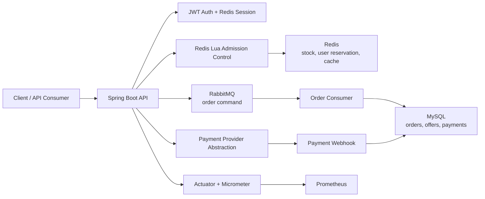

# Flash Sale Platform

Production-oriented flash sale and payment backend built with Spring Boot, Redis, RabbitMQ, MySQL, and Docker.

This project models the core transaction path of a high-concurrency local commerce platform: users compete for limited-time offers, the system performs atomic admission control in Redis, order creation is decoupled through RabbitMQ, and payment state is handled with idempotent webhook processing and stock compensation.

The domain is intentionally shaped around a Belgium/EU portfolio context: EUR-denominated offers, local merchants, and a payment abstraction that can be extended toward providers such as Stripe and Bancontact.

## Architecture



The design separates fast admission control from final transactional persistence. Redis handles the hot path for stock pre-deduction and one-user-one-order checks, while MySQL remains the source of truth for durable order and payment state.

## Core Transaction Flow

```text
Login
  -> publish flash-sale offer
  -> Redis Lua stock and duplicate-order check
  -> Redis reservation
  -> RabbitMQ order message
  -> MySQL order creation
  -> payment order creation
  -> provider webhook
  -> paid order or timeout compensation
```

## Engineering Highlights

- Atomic flash-sale admission with Redis Lua for stock pre-deduction, sale-time validation, and one-user-one-order enforcement.
- RabbitMQ-based asynchronous order creation with publisher confirms, mandatory returns, manual acknowledgements, retry queue, and dead-letter queue.
- Idempotent Redis reservation compensation when message publishing or final order consumption fails after Redis pre-deduction.
- MySQL uniqueness and conditional stock updates as final consistency safeguards against duplicate orders and overselling.
- Payment order state model with amount and currency snapshots.
- Idempotent mock payment webhook flow with provider event records and duplicate-event handling.
- Scheduled timeout cancellation for unpaid orders with MySQL and Redis stock compensation.
- Spring Security authentication filter with JWT access tokens and Redis-backed refresh/session state.
- Actuator and Micrometer metrics exported to Prometheus.
- Docker Compose demo stack for local review and reproducible project evaluation.

## Tech Stack

| Area | Technology |
| --- | --- |
| Language | Java 11 |
| Framework | Spring Boot 2.3.x |
| Security | Spring Security, JWT |
| Persistence | MySQL, MyBatis-Plus |
| Cache and concurrency | Redis, Redis Lua, Redisson |
| Messaging | RabbitMQ |
| Observability | Spring Boot Actuator, Micrometer, Prometheus |
| Build and runtime | Maven Wrapper, Docker, Docker Compose |
| Testing | JUnit 5, Mockito, Spring MVC Test, Testcontainers |

## Quick Start

The fastest way to review the project is the Docker Compose demo stack.

```bash
docker compose up -d --build
```

This starts:

- Spring Boot API
- MySQL with seeded schema and demo data
- Redis
- RabbitMQ with the management UI
- Prometheus

Useful local URLs:

```text
API:        http://localhost:8080
Health:     http://localhost:8080/actuator/health
RabbitMQ:   http://localhost:15672
Prometheus: http://localhost:9090
```

RabbitMQ demo credentials:

```text
username: flash_sale
password: flash_sale
```

The MySQL schema is initialized from:

```text
src/main/resources/db/flash_sale_platform.sql
```

To reset all local container state:

```bash
docker compose down -v
docker compose up -d --build
```

To override local ports or demo credentials:

```bash
cp .env.example .env
docker compose up -d --build
```

## Local Development

Run fast tests:

```bash
./mvnw test
```

Run the application against local infrastructure:

```bash
JWT_SECRET=dev-only-change-me-dev-only-change-me-32bytes \
./mvnw spring-boot:run -Dspring-boot.run.arguments="--spring.profiles.active=local"
```

Default local schema:

```text
flash_sale_platform
```

Important environment variables:

```text
MYSQL_URL
MYSQL_USERNAME
MYSQL_PASSWORD
REDIS_HOST
REDIS_PORT
REDIS_PASSWORD
RABBITMQ_HOST
RABBITMQ_PORT
RABBITMQ_USERNAME
RABBITMQ_PASSWORD
JWT_SECRET
PAYMENT_PROVIDER
MOCK_WEBHOOK_SECRET
GMAIL_FROM
GMAIL_APP_PASS
```

## API Surface

| Area | Endpoint | Purpose |
| --- | --- | --- |
| Auth | `POST /user/code` | Send email verification code |
| Auth | `POST /user/login` | Login and issue access/refresh tokens |
| Auth | `POST /user/refresh` | Rotate refresh token |
| Auth | `POST /user/logout` | Invalidate session |
| Auth | `GET /user/me` | Current user profile |
| Merchant | `GET /merchants/{id}` | Query merchant |
| Merchant | `POST /merchants` | Create merchant, admin only |
| Merchant | `PUT /merchants` | Update merchant, admin only |
| Offer | `POST /offers` | Create offer, admin only |
| Offer | `GET /offers/merchant/{merchantId}` | List merchant offers |
| Flash Sale | `POST /flash-sales` | Create flash-sale offer, admin only |
| Flash Sale | `POST /flash-sales/{offerId}/publish` | Publish and preheat Redis stock |
| Flash Sale | `POST /flash-sales/{offerId}/orders` | Submit flash-sale order request |
| Payment | `POST /payments/orders/{orderId}` | Create payment order |
| Payment | `GET /payments/orders/{orderId}` | Query order/payment status |
| Webhook | `POST /payments/webhooks/mock` | Simulate provider payment success |

## Consistency Design

Redis is used as the high-throughput admission layer, not as the final source of truth.

When a flash-sale request arrives, Lua performs stock validation, duplicate-order validation, sale-window validation, stock pre-deduction, and user reservation atomically in Redis. After that, the application publishes an order command to RabbitMQ.

Redis reservation and RabbitMQ publishing are not a single distributed transaction, so the producer uses publisher confirms and mandatory returns. If publishing clearly fails after Redis reservation, an idempotent Lua compensation script restores the stock and removes the user reservation.

The consumer uses manual acknowledgements and processes messages inside a MySQL transaction. If order creation fails, the message is routed through retry and dead-letter queues. MySQL unique constraints and conditional stock deduction remain the final safeguards against duplicate orders and overselling.

Payment webhooks are handled idempotently through provider event records. Duplicate processed events return success without mutating the business state again; failed or in-progress duplicates are surfaced explicitly.

## Observability

The application exposes:

```text
GET /actuator/health
GET /actuator/prometheus
```

Metrics cover the main business paths:

- authentication success/failure
- flash-sale request outcomes
- RabbitMQ publish/consume outcomes
- order creation outcomes
- payment creation outcomes
- webhook success/failure/duplicate handling
- Redis reservation compensation

Prometheus is included in the local Compose stack and scrapes:

```text
app:8080/actuator/prometheus
```

## Testing

Fast test suite:

```bash
./mvnw test
```

Current coverage focuses on:

- payment service state transitions
- payment webhook idempotency and failure paths
- payment/webhook controllers
- RabbitMQ order consumer behavior
- unpaid order timeout cancellation and stock compensation
- Redis reservation compensation service

Integration tests are available behind the Maven `integration` profile and use Testcontainers for MySQL, Redis, and RabbitMQ-oriented scenarios:

```bash
./mvnw verify -Pintegration
```

## Project Structure

```text
src/main/java/com/flashsale/platform
  config/          Spring, security, RabbitMQ, Redis, OpenAPI configuration
  controller/      REST API controllers
  service/         Business services and transaction workflows
  mq/              RabbitMQ producer, consumer, and message models
  entity/          MySQL-backed domain entities
  mapper/          MyBatis-Plus mappers
  provider/        Payment provider abstraction and mock provider
  observability/   Business metrics
  utils/           JWT, Redis ID generation, cache, mail, validation helpers

src/main/resources
  db/              MySQL schema and seed data
  mapper/          MyBatis XML mappers
  *.lua            Redis Lua scripts for flash-sale and compensation flows

infra/prometheus   Local Prometheus scrape configuration
```

## Current Limitations

- The payment provider is currently a mock provider for local validation; the abstraction is ready for a real provider integration such as Stripe or Bancontact.
- Redis runs without a password in the local Docker demo because Redisson password support is intentionally kept out of the demo setup.
- The Compose stack is designed for local review, not as a hardened production deployment.
- Grafana dashboards are not included yet; Prometheus metrics are exposed and ready to be visualized.

## Portfolio Positioning

This project is intended to demonstrate backend engineering depth around transaction correctness, concurrency control, asynchronous processing, idempotency, and operational visibility. The implementation favors explicit consistency boundaries and observable failure handling over a minimal CRUD-style demo.
