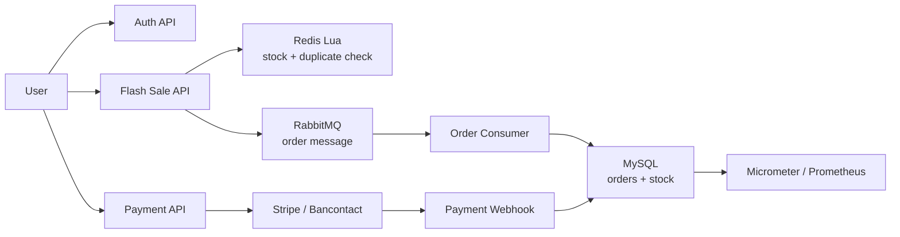

<<<<<<< HEAD
# FlashSale-Redis-System

This project is a high-concurrency flash sale backend system based on a voucher seckill scenario. It uses Redis and Lua scripting for atomic stock validation and one-user-one-order checks, Redis Stream for asynchronous order processing, Redisson distributed locks for duplicate-order prevention, and MySQL for final order persistence.
=======
# Flash Sale Payment Backend

High-concurrency flash sale and payment backend built with Spring Boot, Redis, RabbitMQ, and MySQL.

This project is being refactored from a general coupon and shop demo into a focused backend portfolio project. The target scope is a realistic transaction system: authentication, flash-sale admission control, asynchronous order creation, payment workflow, idempotency, compensation, and observability.

## Project Goal

The project is designed to demonstrate backend engineering depth around a complete transaction flow:

```text
Login
  -> Flash sale request
  -> Redis Lua admission control
  -> Stock pre-deduction
  -> Asynchronous order creation
  -> Payment initiation
  -> Payment webhook
  -> Order completion or compensation
```

The current implementation keeps Redis for cache and atomic flash-sale checks. RabbitMQ is planned to replace Redis Stream as the asynchronous order pipeline, which better reflects common production architecture.

## Core Capabilities

- Email verification login with JWT access token and refresh token support
- Redis-based verification code throttling and login retry protection
- Redis Lua script for atomic flash-sale stock check and one-user-one-order control
- MySQL transaction boundary for final order persistence
- Redisson and Redis utilities for distributed coordination
- Spring Security based authentication filter
- Environment-driven configuration for MySQL, Redis, RabbitMQ, and JWT secret
- Maven Wrapper for reproducible local builds

## Current Scope

The project is intentionally being narrowed to the transaction path:

- Authentication
- Merchant and offer catalog
- Flash-sale offer setup
- Flash-sale order request
- Future payment workflow
- Future monitoring and operational visibility

The old blog, follow, comment, and upload modules have been removed because they do not strengthen the target resume story.

## Planned Architecture



## Tech Stack

- Java 11
- Spring Boot 2.3.x
- Spring Security
- MyBatis-Plus
- MySQL
- Redis
- Redisson
- RabbitMQ
- JWT
- Maven Wrapper

## Main API Areas

| Area | Endpoint | Purpose |
| --- | --- | --- |
| Auth | `POST /user/code` | Send email verification code |
| Auth | `POST /user/login` | Login and issue tokens |
| Auth | `POST /user/refresh` | Rotate refresh token |
| Auth | `POST /user/logout` | Logout |
| Auth | `GET /user/me` | Current user profile |
| Merchant | `GET /merchants/{id}` | Query merchant by id |
| Merchant | `POST /merchants` | Create merchant, admin only |
| Merchant | `PUT /merchants` | Update merchant, admin only |
| Offer | `POST /offers` | Create offer, admin only |
| Offer | `GET /offers/merchant/{merchantId}` | Query offers by merchant |
| Flash Sale | `POST /flash-sales` | Create flash-sale offer, admin only |
| Flash Sale | `POST /flash-sales/{offerId}/orders` | Submit flash-sale order request |

## Local Build

Use the Maven Wrapper included in the repository:

```bash
./mvnw clean test
```

Run the application:

```bash
./mvnw spring-boot:run
```

Important configuration can be supplied through environment variables:

```text
MYSQL_URL
MYSQL_USERNAME
MYSQL_PASSWORD
REDIS_HOST
REDIS_PORT
REDIS_PASSWORD
RABBITMQ_HOST
RABBITMQ_PORT
RABBITMQ_USERNAME
RABBITMQ_PASSWORD
JWT_SECRET
```

## Refactor Roadmap

1. Project boundary cleanup
   - Remove non-core social modules
   - Externalize sensitive configuration
   - Clarify project positioning and documentation

2. RabbitMQ order pipeline
   - Replace Redis Stream with RabbitMQ
   - Add publisher confirm, manual ack, retry queue, and dead-letter queue
   - Add compensation for message publishing or consumption failures

3. Payment module
   - Add payment order model and order state machine
   - Add provider abstraction
   - Integrate Stripe for EUR/Bancontact-oriented payment flow
   - Handle webhook signature verification and idempotency

4. Observability
   - Add Spring Boot Actuator and Micrometer
   - Export Prometheus metrics
   - Build Grafana dashboards for login, flash sale, MQ, order, and payment paths

5. Production readiness
   - Add focused tests for login, flash sale, MQ, and payment idempotency
   - Add Docker Compose for local infrastructure
   - Add load testing and failure scenario documentation

## Resume Positioning

> A high-concurrency flash sale and payment backend built with Spring Boot, Redis, RabbitMQ, and MySQL. The system focuses on atomic stock deduction, asynchronous order processing, idempotency, payment workflow design, compensation, and observability.
>>>>>>> 2d4e3dd ( Please enter the commit message for your changes. Lines starting)
