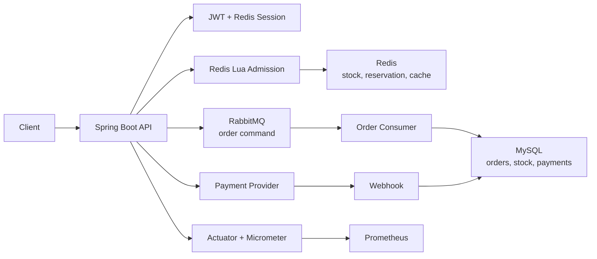

# Flash Sale Platform

A high-concurrency flash-sale transaction backend built with **Java 17 + Spring Boot 3.5**. The project covers authentication, merchants, offers, flash-sale ordering, asynchronous order processing, payment status management, observability, and local containerized deployment.

This is not a CRUD-only demo. It focuses on concurrency control, asynchronous messaging, idempotency, final consistency, and reproducible local verification for a flash-sale scenario.

## Highlights

- Uses Redis Lua for atomic admission control, stock pre-deduction, and one-user-one-order checks.
- Uses RabbitMQ to decouple the order path, with main queue, retry queue, dead-letter queue, publisher confirms, and manual acknowledgements.
- Uses MySQL as the durable source of truth, with conditional stock updates and unique constraints to prevent overselling and duplicate orders.
- Supports Redis stock and reservation compensation when message publishing or asynchronous order processing fails.
- Implements Redis-backed JWT session state, refresh-token rotation, and refresh-token reuse detection.
- Provides a payment provider abstraction with mock payment, payment order state transitions, and idempotent webhook handling.
- Exposes health checks and business metrics through Spring Boot Actuator, Micrometer, and Prometheus.
- Provides Docker Compose for one-command local startup of MySQL, Redis, RabbitMQ, Prometheus, and the application.
- Includes unit tests, integration tests, local smoke tests, k6 load testing, and final consistency verification.

## Architecture



Redis is used as the high-concurrency admission layer. MySQL remains responsible for durable stock, orders, payment state, and final uniqueness guarantees.

## Tech Stack

| Area | Technology |
| --- | --- |
| Language and framework | Java 17, Spring Boot 3.5.16 |
| Web and security | Spring MVC, Spring Security 6, JWT |
| Persistence | MySQL 8.4, MyBatis-Plus 3.5 |
| Cache and concurrency | Redis 7.4, Redis Lua, Redisson |
| Messaging | RabbitMQ 3.13 |
| Payment | Provider abstraction, mock payment, idempotent webhook |
| Observability | Spring Boot Actuator, Micrometer, Prometheus |
| Build and runtime | Maven Wrapper, Docker, Docker Compose |
| Testing | JUnit 5, Mockito, Testcontainers, k6 |

## Quick Start

```bash
docker compose up -d --build
```

Default local URLs:

| Service | URL |
| --- | --- |
| API | http://localhost:8080 |
| Health | http://localhost:8080/actuator/health |
| Swagger UI | http://localhost:8080/swagger-ui/index.html |
| RabbitMQ Management | http://localhost:15672 |
| Prometheus | http://localhost:9090 |

RabbitMQ local credentials:

```text
username: flash_sale
password: flash_sale
```

If port `8080` is already in use, map the API to another host port:

```bash
APP_PORT=18080 docker compose up -d --build
```

Stop the stack:

```bash
docker compose down
```

Reset all local volumes and seed data:

```bash
docker compose down -v
docker compose up -d --build
```

## Smoke Check

```bash
curl http://localhost:8080/actuator/health
curl http://localhost:8080/actuator/prometheus
```

For demo login, inject a temporary verification code into the local Redis container:

```bash
docker exec flash-sale-platform-redis \
  redis-cli SETEX login:code:alice@example.com 120 123456

curl -X POST http://localhost:8080/user/login \
  -H "Content-Type: application/json" \
  -d '{"email":"alice@example.com","code":"123456"}'
```

## Tests

Unit tests:

```bash
./mvnw -B test
```

Integration tests:

```bash
./mvnw -B -Pintegration verify
```

Docker build:

```bash
docker build -t flash-sale-platform:local .
```

Current verified status:

- Unit tests: 60 passing.
- Integration tests: 22 passing.
- Docker image build: passing.
- Docker Compose smoke test: passing, covering health, Prometheus metrics, login, authentication, MySQL queries, Redis session state, RabbitMQ queues, and Prometheus target health.

## Load Testing

The project includes k6 scripts and final consistency verification for the flash-sale path.

```bash
USERS=5000 STOCK=100 node load-tests/scripts/prepare-load-data.mjs

k6 run \
  -e BASE_URL=http://localhost:8080 \
  -e OFFER_ID=900001 \
  -e TOKEN_FILE=load-tests/out/tokens.json \
  -e VUS=300 \
  -e ITERATIONS=5000 \
  -e MAX_DURATION=2m \
  load-tests/k6/flash-sale-order.js

USERS=5000 STOCK=100 EXPECTED_ACCEPTED=100 \
  node load-tests/scripts/verify-load-result.mjs
```

See the local baseline report in [docs/load-test-report-local.md](docs/load-test-report-local.md).

## API Overview

| Module | Endpoint | Description |
| --- | --- | --- |
| Auth | `POST /user/code` | Send email verification code |
| Auth | `POST /user/login` | Log in and issue access/refresh tokens |
| Auth | `POST /user/refresh` | Rotate refresh token |
| Auth | `POST /user/logout` | Log out and clear session state |
| Auth | `GET /user/me` | Get current user profile |
| Merchant | `GET /merchants/{id}` | Get merchant details |
| Offer | `GET /offers/merchant/{merchantId}` | List merchant offers |
| Flash Sale | `POST /flash-sales/{offerId}/publish` | Publish flash-sale offer and preheat stock |
| Flash Sale | `POST /flash-sales/{offerId}/orders` | Submit flash-sale order request |
| Payment | `POST /payments/orders/{orderId}` | Create payment order |
| Payment | `GET /payments/orders/{orderId}` | Query payment status |
| Webhook | `POST /payments/webhooks/mock` | Simulate successful payment webhook |

## Project Structure

```text
src/main/java/com/flashsale/platform
  config/          Spring Security, RabbitMQ, Redis, MyBatis, OpenAPI
  controller/      REST APIs
  service/         Core business workflows
  mq/              RabbitMQ producer, consumer, and message models
  entity/          Domain entities
  mapper/          MyBatis-Plus mappers
  provider/        Payment provider abstraction and mock implementation
  observability/   Business metrics
  utils/           JWT, Redis, cache, mail, and validation helpers

src/main/resources
  db/              MySQL schema and seed data
  mapper/          MyBatis XML files
  *.lua            Redis Lua scripts

load-tests/        k6 load tests and consistency verification
docs/              Reliability notes, performance testing, and load-test reports
infra/prometheus   Local Prometheus configuration
```

## Design Notes

The flash-sale path uses layered safeguards:

| Layer | Responsibility |
| --- | --- |
| Redis Lua | Atomically checks sale window, stock, and duplicate reservation, then pre-deducts stock |
| RabbitMQ | Processes order creation asynchronously and isolates API admission from database writes |
| Compensation | Restores Redis stock and user reservation state after message or consumer failure |
| MySQL | Enforces conditional stock deduction, unique order constraints, and durable payment state |
| Webhook event table | Records provider events and guarantees idempotent payment webhook handling |

More details are available in [docs/reliability-and-consistency.md](docs/reliability-and-consistency.md).

## Current Limitations

- The payment provider is currently a mock implementation; the abstraction is ready for real providers such as Stripe or Bancontact.
- Docker Compose is intended for local demonstration and verification, not production deployment.
- Redis runs without a password in the local demo; production deployments should use authentication, network isolation, and secret management.
- Prometheus metrics are exposed, but Grafana dashboards are not included yet.
